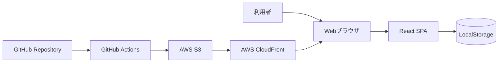
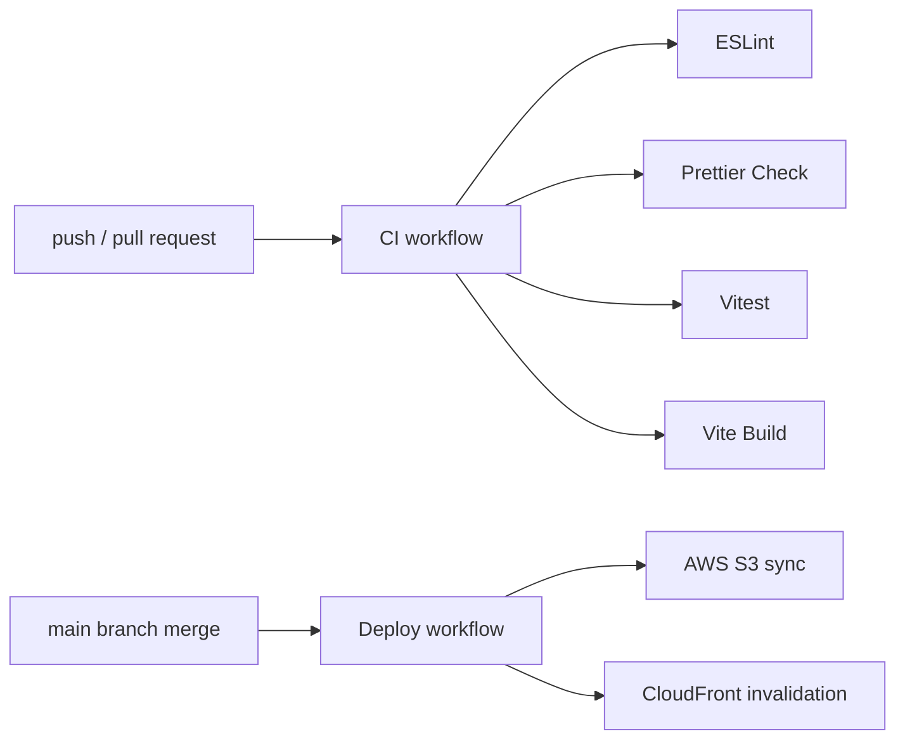

# Pomodoro Timer システム設計書

## 文書管理

| 項目 | 内容 |
| --- | --- |
| サービス名 | Pomodoro Timer |
| フェーズ | Phase2 システム設計 |
| ステータス | レビュー用ドラフト |
| 作成日 | 2026-06-22 |
| 最終更新日 | 2026-06-22 |

## 1. Phase2の目的

Phase2では、Phase1で承認された要件をもとに、実装前にシステム構成、アプリケーション構成、データ設計、主要処理フロー、品質方針を定義する。

このフェーズの目的は、実装担当者が迷わず開発計画を立てられる状態にすることである。

## 2. 設計方針

| ID | 方針 | 内容 |
| --- | --- | --- |
| DP-001 | シンプルな静的SPA | 初期リリースではReact + TypeScript + Viteによる静的SPAとして構成する。 |
| DP-002 | ローカル永続化 | 作業履歴はLocalStorageへ保存し、バックエンドは持たない。 |
| DP-003 | 責務分離 | UI、状態管理、永続化処理、型定義、ユーティリティを分離する。 |
| DP-004 | テスト可能性 | タイマー計算とLocalStorage操作はUIから分離し、Vitestで検証可能にする。 |
| DP-005 | 将来拡張性 | Note記事管理やAI記事レビューへ発展できるよう、ドメインロジックとUIを密結合させない。 |

## 3. システム全体構成



## 4. 実行時アーキテクチャ

| レイヤー | 役割 | 主な配置先 |
| --- | --- | --- |
| Page | 画面単位の構成を担当する。 | `src/pages/` |
| Component | ボタン、タイマー表示、履歴一覧などのUI部品を担当する。 | `src/components/` |
| Hook | タイマー状態や履歴操作など、画面ロジックを再利用可能にする。 | `src/hooks/` |
| Service | LocalStorageの読み書きなど、外部境界とのやり取りを担当する。 | `src/services/` |
| Store | 必要に応じてアプリケーション状態を集約する。初期リリースでは軽量に扱う。 | `src/store/` |
| Type | ドメイン型、画面用型、永続化データ型を定義する。 | `src/types/` |
| Utils | 時間計算やフォーマットなどの純粋関数を配置する。 | `src/utils/` |
| Test | ユニットテスト、コンポーネントテストを配置する。 | `src/tests/` |

## 5. 推奨ディレクトリ構成

```text
src/
├─ app/
│  └─ App.tsx
├─ pages/
│  └─ TimerPage.tsx
├─ components/
│  ├─ TimerDisplay.tsx
│  ├─ TimerControls.tsx
│  └─ WorkHistoryList.tsx
├─ hooks/
│  ├─ usePomodoroTimer.ts
│  └─ useWorkHistory.ts
├─ services/
│  └─ workHistoryStorage.ts
├─ store/
│  └─ README.md
├─ types/
│  └─ workSession.ts
├─ utils/
│  ├─ time.ts
│  └─ storage.ts
└─ tests/
   ├─ timer.test.ts
   └─ workHistoryStorage.test.ts
```

## 6. データ設計

### 6.1 WorkSession

作業履歴は以下のデータ構造で扱う。

| 項目 | 型 | 必須 | 説明 |
| --- | --- | --- | --- |
| id | string | 必須 | セッションを一意に識別するID。 |
| startedAt | string | 必須 | 作業開始日時。ISO 8601形式。 |
| endedAt | string | 任意 | 作業終了日時。ISO 8601形式。 |
| durationSeconds | number | 必須 | 記録された作業時間。秒単位。 |
| status | `completed` \| `stopped` | 必須 | 完了または停止の状態。 |

### 6.2 LocalStorageキー

| 用途 | キー | 値 |
| --- | --- | --- |
| 作業履歴 | `pomodoro.workSessions.v1` | `WorkSession[]` のJSON文字列 |

永続化キーにはバージョンを含める。将来データ構造が変わった場合に移行しやすくするためである。

## 7. タイマー設計

タイマーは単純な残秒カウントではなく、基準時刻から残り時間を計算する。

初期リリースでは、作業履歴はタイマーが完了した時点で保存する。ユーザーが途中停止しただけでは履歴を保存しない。停止状態のセッション保存が必要になった場合は、後続フェーズで明示的な「記録」操作または「停止時に保存する」仕様として追加検討する。

| 状態 | 説明 |
| --- | --- |
| idle | 初期状態。タイマーは開始していない。 |
| running | タイマーが実行中。 |
| paused | タイマーが一時停止中。 |
| completed | タイマーが完了し、履歴保存対象になった状態。 |

### 7.1 タイマー計算方針

- 実行開始時刻を保持する。
- 経過時間は現在時刻との差分で算出する。
- 画面更新は短い間隔で行うが、真の残り時間は時刻差分から算出する。
- ブラウザタブが非アクティブになった場合でも、復帰時に時刻差分から補正する。

### 7.2 完了時の履歴保存方針

- `usePomodoroTimer` はタイマー状態、開始時刻、終了時刻、実作業時間を判断できる情報を保持する。
- 残り時間が0秒以下になった場合、`usePomodoroTimer` は状態を `completed` にする。
- `TimerPage` は `completed` への状態遷移を検知し、履歴保存用の `WorkSession` を組み立てる。
- `TimerPage` は組み立てた `WorkSession` を `useWorkHistory.addSession()` に渡す。
- `useWorkHistory` は `workHistoryStorage` を通じてLocalStorageへ保存する。
- 二重保存を避けるため、同一完了イベントに対して履歴追加は1回だけ行う。

### 7.3 UIとロジックの境界

- `usePomodoroTimer` はタイマー状態遷移と時間計算を担当する。
- `useWorkHistory` は作業履歴の状態管理と永続化呼び出しを担当する。
- `TimerPage` はタイマー完了イベントと履歴保存をつなぐ調停役を担当する。
- `TimerDisplay` と `TimerControls` は表示とユーザー操作の通知のみを担当し、履歴保存処理を持たない。

## 8. エラーハンドリング方針

| ケース | 方針 |
| --- | --- |
| LocalStorageにデータがない | 空配列として扱う。 |
| LocalStorageのJSONが壊れている | 空配列へフォールバックし、アプリを停止させない。 |
| 保存時に例外が発生する | UI上では最低限のエラー状態を扱えるようにし、詳細はテストで確認する。 |
| 不正な作業履歴データ | 読み込み時に最低限の型チェックを行い、不正データは破棄する。 |

## 9. CI/CD設計概要

詳細は後続フェーズで定義するが、設計上は以下の流れを前提とする。



## 10. セキュリティ設計方針

- AWSアクセスキーなどの秘密情報はリポジトリに保存しない。
- GitHub ActionsではSecretsまたはOIDCを利用する。
- `.env.example` にはダミー値のみを記載する。
- フロントエンドに秘匿情報を埋め込まない。

## 11. 将来拡張への考慮

| 将来機能 | 今回の設計上の配慮 |
| --- | --- |
| Note記事管理 | `services/` と `types/` を分け、記事ドメインを追加しやすくする。 |
| AI記事レビュー | AI API呼び出しを将来的に `services/` 配下へ分離できる構成にする。 |
| バックエンド連携 | LocalStorage serviceをRepository的な境界として扱い、将来API実装へ差し替えやすくする。 |
| ユーザー認証 | 初期リリースでは対象外だが、UIと永続化ロジックを密結合させない。 |

## 12. Phase2 成果物

| 成果物 | パス | ステータス |
| --- | --- | --- |
| システム設計書 | `docs/architecture/architecture.md` | レビュー用ドラフト |
| シーケンス図 | `docs/architecture/sequence-diagram.md` | レビュー用ドラフト |
| 画面設計書 | `docs/design/screen-design.md` | レビュー用ドラフト |
| コンポーネント設計書 | `docs/design/component-design.md` | レビュー用ドラフト |
| ADR: React採用 | `docs/architecture/adr/0001-react-adoption.md` | レビュー用ドラフト |
| ADR: S3 / CloudFront採用 | `docs/architecture/adr/0002-s3-cloudfront.md` | レビュー用ドラフト |

## 13. Phase2 レビュー観点

レビューでは以下を確認する。

- Phase1要件を設計が満たしているか
- 初期リリースに対して過剰設計になっていないか
- 将来拡張への最低限の余地があるか
- タイマー精度に関する設計方針が妥当か
- LocalStorageのデータ設計とエラーハンドリングが妥当か
- ディレクトリ構成が実装担当者にとって分かりやすいか
- CI/CDとAWS配信の前提が後続フェーズで具体化できるか

## 14. Phase2 完了条件

Phase2は以下を満たした時点で完了とする。

- Phase2成果物が作成されている。
- システム構成、データ設計、画面設計、コンポーネント設計、ADRがレビューされている。
- 必要な修正が反映されている。
- プロジェクトオーナーがPhase2を明示的に承認している。
- Phase3 開発計画へ進むことが許可されている。
