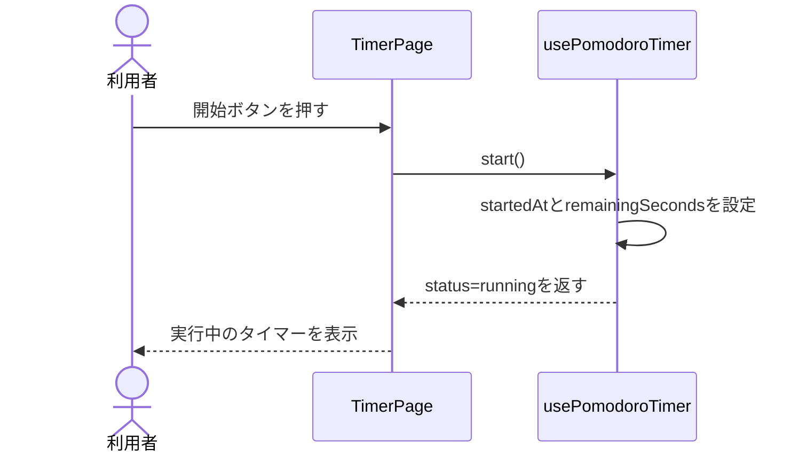
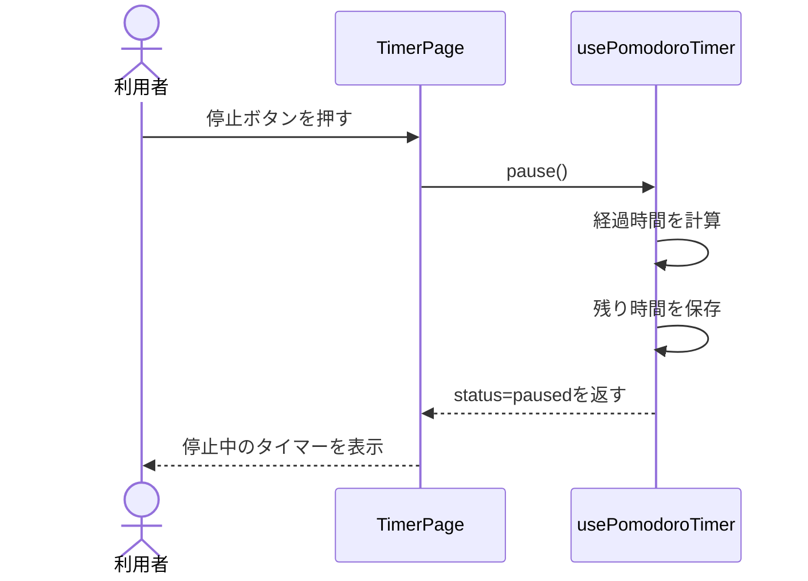
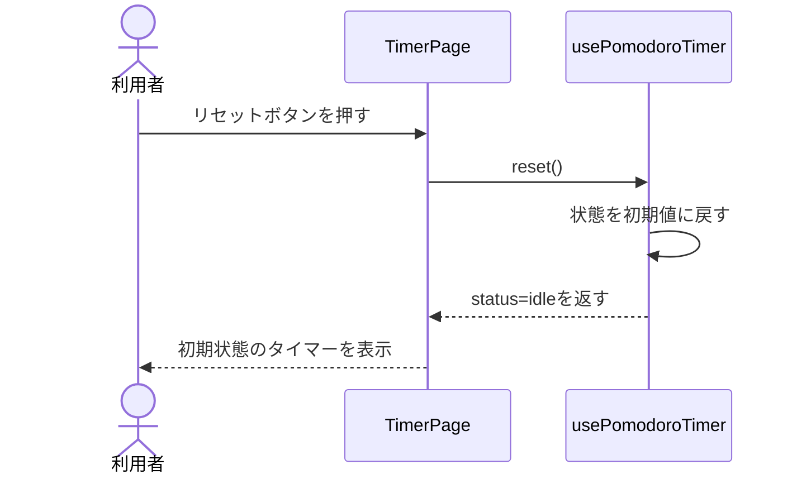
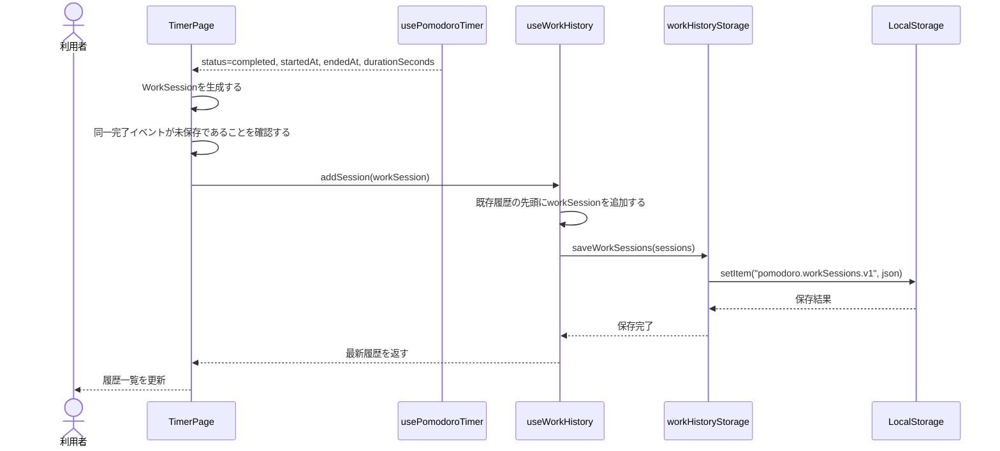
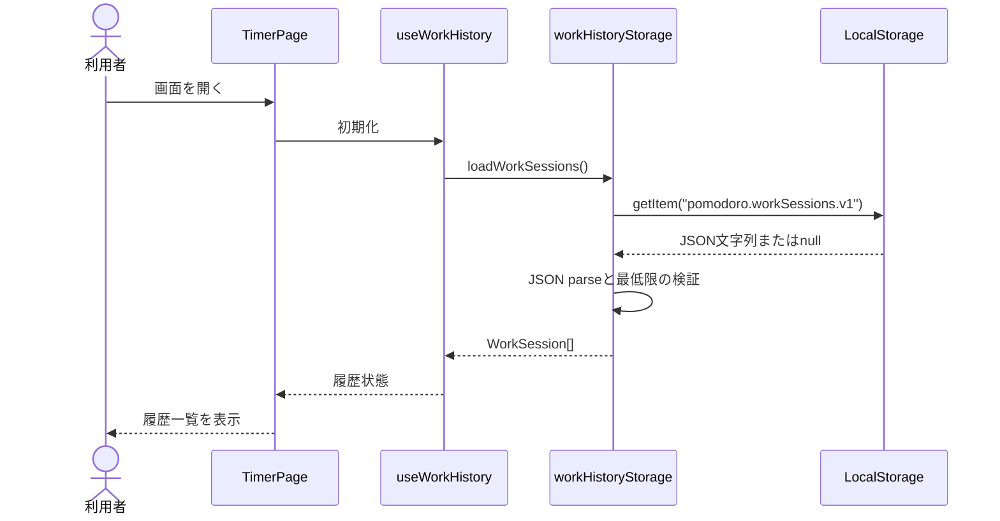

# Pomodoro Timer シーケンス図

## 文書管理

| 項目 | 内容 |
| --- | --- |
| サービス名 | Pomodoro Timer |
| フェーズ | Phase2 システム設計 |
| ステータス | レビュー用ドラフト |
| 作成日 | 2026-06-22 |
| 最終更新日 | 2026-06-22 |

## 1. 目的

本書は、Pomodoro Timerの主要操作について、ユーザー、UI、Hook、Service、LocalStorageの責務と処理順序を明確にする。

## 2. タイマー開始

## 3. タイマー停止

## 4. タイマーリセット

## 5. タイマー完了時の作業履歴保存

タイマー完了時、`usePomodoroTimer` は履歴を直接保存しない。`TimerPage` が `completed` への状態遷移を検知し、タイマー情報から `WorkSession` を組み立てて `useWorkHistory` に渡す。

### 5.1 WorkSession生成ルール

| 項目 | 設定元 |
| --- | --- |
| id | `crypto.randomUUID()` などで生成する。 |
| startedAt | `usePomodoroTimer` が保持する開始日時。 |
| endedAt | 完了検知時の日時。 |
| durationSeconds | 初期リリースでは25分を秒換算した値、またはタイマーHookが返す実作業秒数。 |
| status | タイマー完了時は `completed` とする。 |

途中停止のみでは履歴を保存しない。`stopped` は将来、明示的な中断記録機能を追加する場合に利用する。

## 6. 作業履歴読み込み

## 7. レビュー観点

- 各操作の責務分担が明確か
- UIと永続化処理が直接結合していないか
- LocalStorageの読み書きがServiceに閉じているか
- タイマー完了時の履歴保存フローが自然か
- TimerHookからHistoryHookへ直接依存せず、TimerPageが調停役になっているか
- 同一完了イベントによる二重保存を避ける考慮があるか
- 後続のテストケースへ展開しやすい粒度か

## 8. 完了条件

- 主要操作のシーケンスが記載されている。
- Phase1の機能要件をすべてカバーしている。
- レビューで処理順序に重大な矛盾がないことを確認している。
